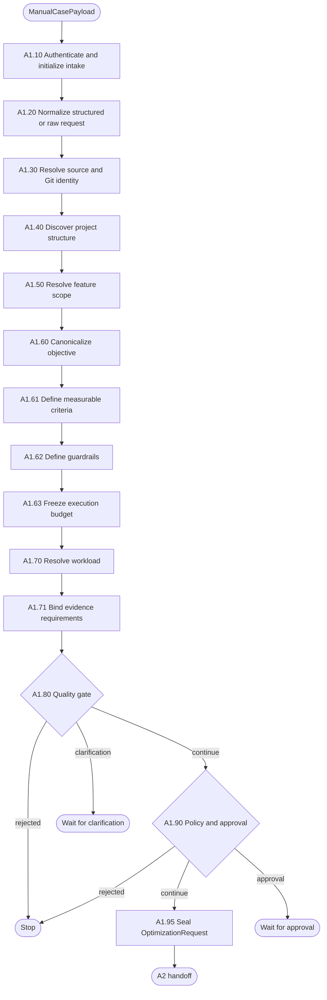

# A1 — Requirement Intake

A1 converts a manual optimization request into one approved, immutable
`OptimizationRequest`. It resolves ambiguity and validates scope before A2 is
allowed to execute anything.

## Package map

- `registry.py`: A1 node specifications, allowed routes and runtime registration.
- `shared.py`: artifact, source-discovery, model-extraction and validation helpers.
- `nodes/`: one directly executable implementation per A1 business node.
- `__init__.py`: stable package exports.

## Flow

## Invariants

- Source paths must remain inside the approved root.
- Unknown or conflicting request fields are never silently invented.
- Every criterion and guardrail must have an evidence requirement.
- A2 starts only after A1.80 passes and A1.90 authorizes the exact digest.

