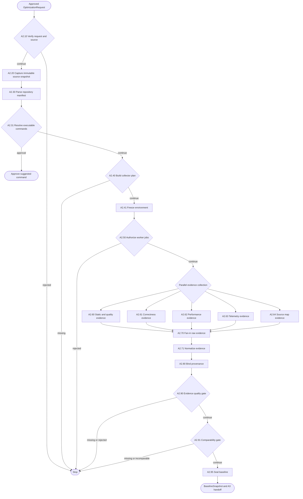

# A2 — Evidence Collection and Baseline

A2 materializes the approved source, executes only authorized repository-owned
workloads and produces a comparable, provenance-bound `BaselineSnapshot`.

## Package map

- `registry.py`: all 18 registrations, route policy, side-effect classes and runtime factory.
- `shared.py`: repository discovery, worker, evidence, artifact and normalization helpers.
- `nodes/`: direct implementation of every A2 node.
- `__init__.py`: stable public exports.

## Flow

## Invariants

- A2 executes frozen `argv`; it does not generate arbitrary shell commands.
- Worker execution requires policy authorization and configured `NodePorts`.
- Raw samples are preserved before normalization or aggregation.
- Missing telemetry or benchmark capability is reported as unavailable, never fabricated.
- A2.95 fails closed unless quality and comparability both pass.

