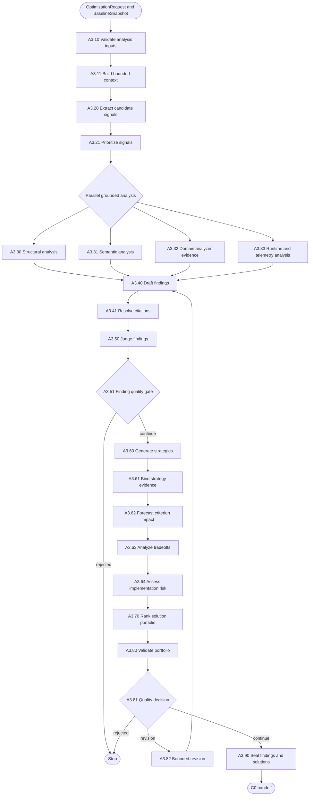

# A3 — Grounded Problem and Solution Analysis

A3 turns the approved request and real baseline into evidence-cited findings and
an eligible solution portfolio. It proposes changes but does not modify source.

## Package map

- `registry.py`: A3 handler lookup.
- `shared.py`: model, artifact, citation, quality and revision helpers.
- `nodes/`: one direct implementation per A3 node.
- `__init__.py`: stable package exports.

## Flow

## Invariants

- Findings must cite evidence or source references from the sealed context.
- Model output is schema-validated and repaired only within bounded retries.
- A3 does not claim measured improvement and never edits the repository.
- Revision loops are bounded and recorded in state.

