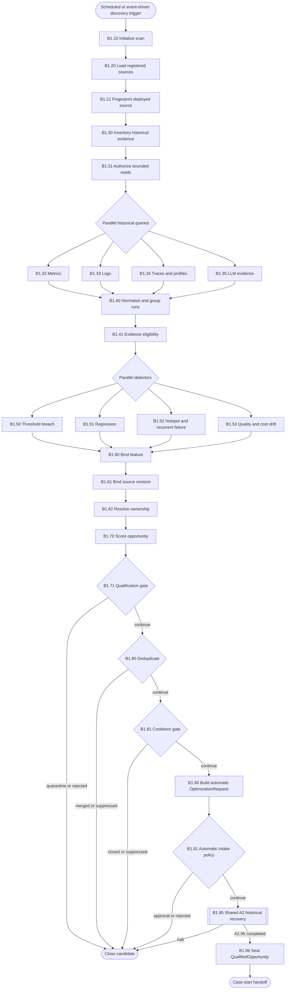

# B1 — Automatic Discovery and Qualification

B1 scans approved historical production evidence, detects optimization
opportunities, reconstructs an A1-equivalent request and recovers the baseline
through the shared A2 subgraph.

## Package map

- `registry.py`: B1 handler lookup; B1.95 remains a mounted A2 subgraph.
- `shared.py`: query, detection, binding, artifact and qualification helpers.
- `nodes/`: direct implementations for native B1 nodes and explicit subgraph marker for B1.95.
- `__init__.py`: stable package exports.

## Flow

## Invariants

- B1 never launches a special discovery benchmark.
- Queries are tenant-scoped, read-only, time-bounded and policy-authorized.
- A candidate needs feature, source and owner bindings before qualification.
- B1.95 uses the exact A2 graph in `historical_recovery` mode.
- One scan may create zero or many isolated qualified opportunities.

