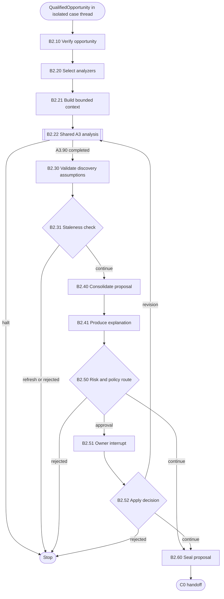

# B2 — Automatic Proposal

B2 consumes one B1-qualified opportunity, revalidates its assumptions, invokes
the shared A3 analysis and routes the resulting proposal according to risk and
owner policy.

## Package map

- `registry.py`: B2 handler lookup; B2.22 remains a mounted A3 subgraph.
- `shared.py`: artifact, staleness, risk, approval and proposal helpers.
- `nodes/`: direct native B2 implementations and explicit B2.22 subgraph marker.
- `__init__.py`: stable package exports.

## Flow

## Invariants

- B2 accepts only a digest-valid, fresh `QualifiedOpportunity`.
- B2.22 reuses the exact A3 graph; it is not a duplicate implementation.
- Material discovery assumptions are revalidated before proposal publication.
- Approval binds the exact proposal digest, role, policy version and expiry.

