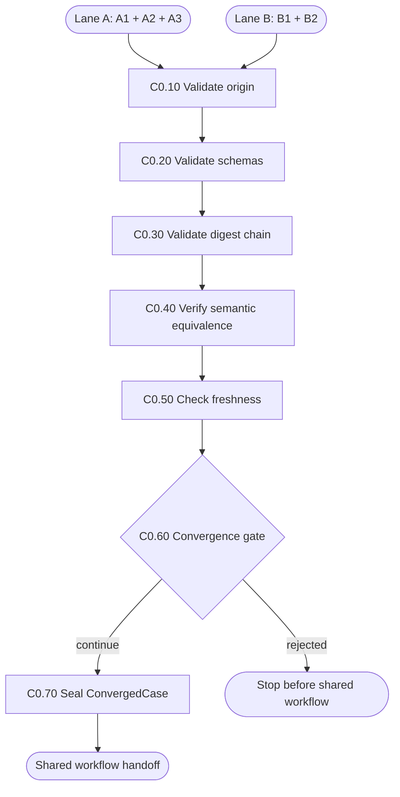

# C0 — Cross-Lane Convergence

C0 is the lane-neutral gate that proves Lane A and Lane B produced equivalent,
fresh and internally consistent optimization packages before shared execution
and selection stages begin.

## Package map

- `registry.py`: C0 handler lookup.
- `shared.py`: schema, digest, freshness, artifact and Git helpers.
- `nodes/`: one direct implementation per convergence node.
- `__init__.py`: stable package exports.

## Flow

## Invariants

- Origin is retained for audit but cannot weaken quality requirements.
- Artifact schema versions and canonical digests must validate.
- Lane B must meet the same request, baseline and solution quality bar as Lane A.
- Stale source, evidence, approval or ownership blocks convergence.
- C0 reports reasons deterministically and never repairs producer artifacts.

