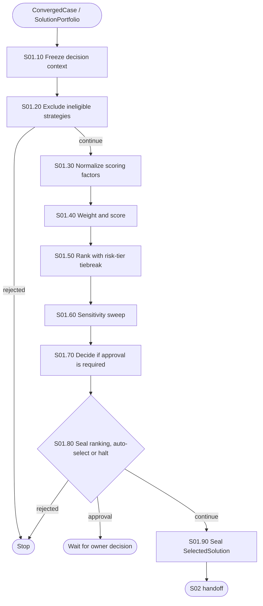

# S01 — Rank and Select

S01 is the first shared-workflow step after C0. It turns a `ConvergedCase`'s
eligible `SolutionPortfolio` into one selected strategy: re-ranked against the
criteria A1 froze, or handed to a human to decide when risk, sensitivity or
confidence say it should not auto-select.

## Package map

- `registry.py`: S01 handler lookup.
- `shared.py`: scoring, ranking, sensitivity and pass-scoping helpers.
- `nodes/`: one direct implementation per S01 node.
- `__init__.py`: stable package exports.

## Flow

## Invariants

- Ineligible, non-reversible, unresolved-scope or previously-REVERTed
  strategies never reach ranking (`BR-01-001`).
- Ranking prefers real score; a lower risk tier only breaks a genuine tie
  (`BR-01-003`), never overrides one.
- A `code`/`architecture` risk ceiling, a sensitivity-flagged ranking, or a
  low-confidence winner always halts for a real, resumable owner decision
  instead of auto-selecting (`BR-01-004`).
- A REVERT (S06.80) re-enters S01 with one more excluded strategy; every
  sealed artifact from that pass is pass-scoped so it never collides with
  the prior pass's (`BR-01-005`).
