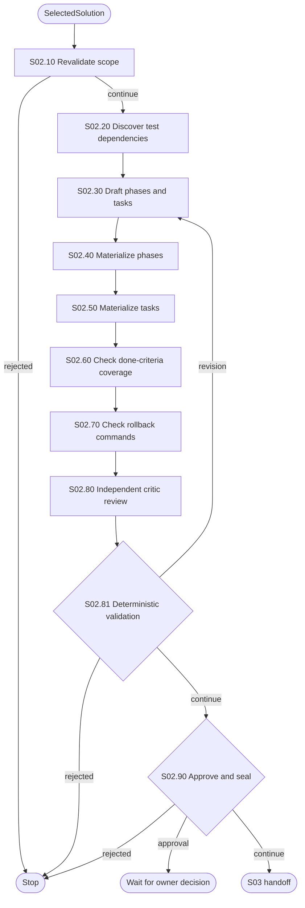

# S02 — Plan and Task List

S02 turns S01's `SelectedSolution` into an executable, phased plan. It resolves
exact source targets, drafts ordered phases and tasks, and validates the draft
deterministically before anything downstream can implement it.

## Package map

- `registry.py`: S02 handler lookup.
- `shared.py`: model, draft-validation and revision-loop helpers.
- `nodes/`: one direct implementation per S02 node.
- `__init__.py`: stable package exports.

## Flow

## Invariants

- Every phase changes exactly one logical treatment.
- Diagnostic (cheap, reversible) phases must sequence strictly before any
  implementation (expensive) phase -- `phase_ordering_by_risk` at S02.81.
- `ExecutionPlan`/`TaskList`/`PlanQualityReport` are sealed only by S02.81, and
  only once every deterministic dimension passes -- a broken draft never gets
  a fabricated digest.
- The revision loop (S02.30 <-> S02.81) is bounded and recorded in state.
- A `code`/`architecture` risk-ceiling strategy always halts for a real,
  resumable owner approval at S02.90.
